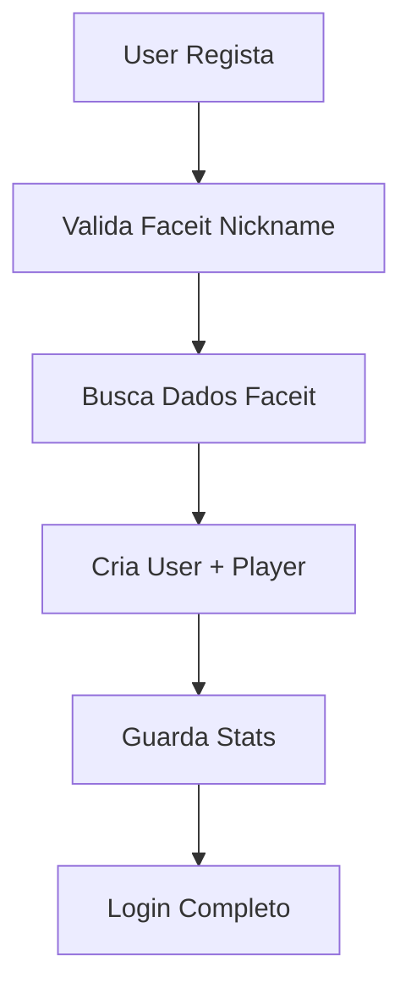

# 🎯 Configuração da Integração Faceit

## 📋 Pré-requisitos

Para usar a integração com o Faceit, precisas de:

1. **API Key do Faceit** (grátis até 10,000 requests/mês)
2. **Conta de Developer** no Faceit

## 🔑 Como Obter a API Key

1. Vai a [https://developers.faceit.com/](https://developers.faceit.com/)
2. Cria uma conta ou faz login
3. Vai para **"My Apps"**
4. Clica em **"Create App"**
5. Preenche os detalhes:
   - **App Name:** CS2Hub
   - **Description:** CS2 Player Stats Integration
   - **Website:** http://localhost:5173
6. Copia a **API Key** gerada

## ⚙️ Configuração

Adiciona ao teu ficheiro `.env`:

```bash
# Faceit API Integration
FACEIT_API_KEY=your_faceit_api_key_here
```

## 🧪 Testar a Integração

```bash
# Executar o servidor
npm run dev

# Testar um endpoint (substitui 'player_nickname' por um nickname real)
curl "http://localhost:5000/api/faceit/test/player_nickname"
```

## 📊 Dados Importados

A integração busca automaticamente:

### **Dados Básicos**
- ✅ Faceit ID
- ✅ Nickname verificado
- ✅ Avatar
- ✅ País
- ✅ Steam ID
- ✅ Nível Faceit (1-10)
- ✅ ELO atual
- ✅ URL do perfil

### **Estatísticas CS2**
- ✅ K/D Ratio
- ✅ Average K/D
- ✅ Headshot %
- ✅ Win Rate %
- ✅ Matches jogados
- ✅ Vitórias
- ✅ Current Win Streak
- ✅ Longest Win Streak

## 🔄 Atualização Automática

- Stats são **atualizadas automaticamente** no registo
- Timestamp guardado em `faceit_stats_updated_at`
- Futuro: Atualização periódica das stats

## ⚠️ Limitações

- **10,000 requests/mês** na versão grátis
- **Rate limit:** ~100 requests/minuto
- **CS2 apenas:** Não suporta CS:GO legacy stats

## 🛠️ Troubleshooting

### Erro: "Faceit API key não configurada"
- Verifica se `FACEIT_API_KEY` está no `.env`
- Reinicia o servidor após adicionar

### Erro: "Nickname do Faceit não encontrado"
- Nickname tem de existir no Faceit
- Verifica se joga CS2 (não CS:GO)
- Tenta com outro nickname

### Erro: "Erro ao conectar com Faceit"
- Verifica conexão à internet
- API key pode estar inválida
- Rate limit pode ter sido atingido

## 🎮 Como Funciona



## 🚀 Próximos Passos

- [ ] **Sync periódico** de stats
- [ ] **Webhook** para updates em tempo real
- [ ] **Match history** integração
- [ ] **Team stats** agregadas
- [ ] **Ranking system** baseado em ELO 